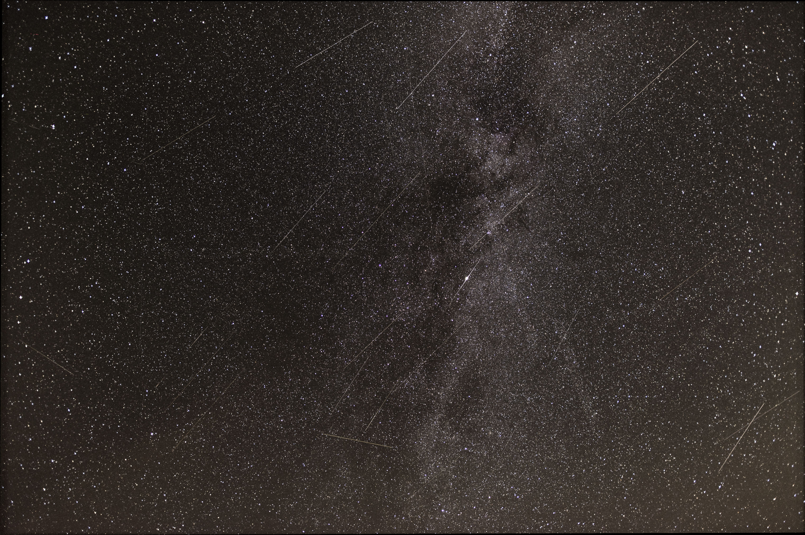

# Deep Sky Astrophotography Animation
Repo containing python code and results of a project to animate deep sky photographs

  
 

## Details
Given two deep sky photogtraphs taken on clear summer nights, one with shooting star lines and one without, animates shooting stars on the given photograph so that you obtain an animated deep sky video of the perseids

## Author & Contributors
Python code: Lionel Voirol

Pictures taken by Christian Voirol during the summer 2018 in Switzerland (Mont Tendre)
